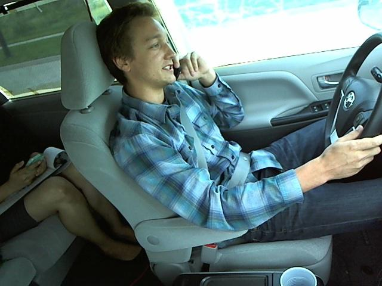

# Distracted-Driver

This repository contains training of res-net 50 on Distracted Driver. The dataset is taken from a [kaggle competition](https://www.kaggle.com/c/state-farm-distracted-driver-detection/data).

* The code is in training.ipynb.

* To run the jupyter notebook download the dataset from kaggle and extract it in the current directory.

* __The submission obtained a public score of 0.46098 rank around (top 20 %)__

## Dataset Overview

The dataset consists 22,424 images of drivers driving cars. The objective is to predict the driver state.
The 10 classes to predict are:
-  c0: safe driving
-  c1: texting - right
-  c2: talking on the phone - right
-  c3: texting - left
-  c4: talking on the phone - left
-  c5: operating the radio
-  c6: drinking
-  c7: reaching behind
-  c8: hair and makeup
-  c9: talking to passenger

## Example Images

Example of c1 class i.e. texting from right hand

Example of c4 class i.e. talking from left hand

## Resnet Overview

The model used here is [ResNet50](https://arxiv.org/abs/1512.03385). ResNet are also called as Residual Neural Networks. Since deeper neural networks are more difficult to train so  resnet  explicitly reformulate the layers as learning residual functions with reference to the layer inputs, instead of learning unreferenced functions. These residual networks are easier to optimize, and can gain accuracy from considerably increased depth.

